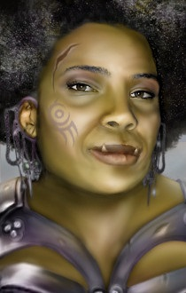

<html>

<b>Ariena</b>

<b>NPC mod for BG2EE and EET</b>

Original mod by Guido Voets  
One of the NPCs of the "Mod for the Wicked" series.

- Ariena is a neutral evil pit fighter. 
- She is a Half-orc of an unusual human parentage.
- She is hunted by he former slaver owners of the pits.
- Her quest includes the search for her mother and different solutions to confront the woman who once sold her daughter to the pits.

  
  

 
&nbsp;

&nbsp;

</body>

</html>

